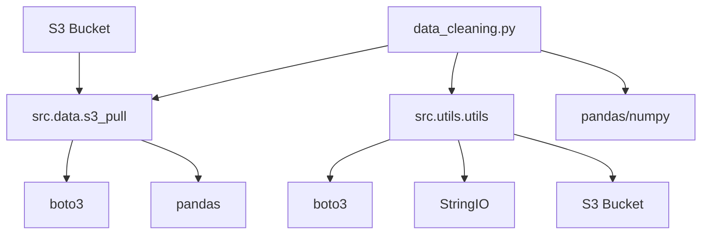

프로젝트의 tree 구조와 `data_cleaning.py` 파일을 분석해서 의존성부터 설명해드리겠습니다.
Ran tool
Ran tool
Read file: requirements.txt
## 🏗️ Tree 구조 및 data_cleaning.py 의존성 분석

### 📁 프로젝트 구조 개요
```
mlops-cloud-project-mlops-7/
├── src/                    # 메인 소스코드
│   ├── data/              # 데이터 처리 모듈
│   ├── models/            # 머신러닝 모델
│   ├── utils/             # 공통 유틸리티
│   └── preprocessing/     # 전처리 (별도)
├── api/                   # FastAPI 서버
├── notebooks/             # Jupyter 노트북
├── data/                  # 로컬 데이터 저장소
├── models/                # 학습된 모델 저장소
└── dockerfiles/           # Docker 설정
```

### 🔗 data_cleaning.py 의존성 구조

#### **1. 외부 라이브러리 의존성**
```python
# 시스템 및 경로
import os, sys
sys.path.append('/app')  # Docker 환경 경로

# 데이터 처리 핵심
import pandas as pd      # 데이터프레임 조작
import numpy as np       # 수치 연산

# AWS/S3 연동
import boto3            # AWS SDK
from io import StringIO # 메모리 내 CSV 처리
```

#### **2. 내부 모듈 의존성**
```python
# S3에서 데이터 가져오기
from src.data.s3_pull import get_s3_data

# S3에 데이터 저장하기  
from src.utils.utils import save_to_s3
```

### 🔄 의존성 흐름도



### 📋 주요 함수별 역할

#### **1. clean_weather_data()**
- **목적**: 원시 날씨 데이터 정제
- **작업**: 컬럼명 변경, 타입 변환, 불필요 컬럼 제거
- **입력**: 원시 DataFrame (STN, TA, PM10 등)
- **출력**: 정제된 DataFrame (station_id, temperature, pm10 등)

#### **2. add_time_features()**
- **목적**: 시간 기반 파생 변수 생성
- **생성 변수**: 
  - `hour`, `day_of_week`, `month`
  - `is_morning_rush`, `is_evening_rush`, `is_rush_hour`
  - `is_weekday`, `is_weekend`, `season`

#### **3. add_temp_features()**
- **목적**: 온도 기반 파생 변수 생성
- **생성 변수**:
  - `temp_category` (very_cold, cold, mild, warm, hot)
  - `temp_comfort` (20℃ 기준 쾌적도)
  - `temp_extreme`, `heating_needed`, `cooling_needed`

#### **4. add_region_features()**
- **목적**: 관측소 위치 기반 파생 변수
- **생성 변수**:
  - `is_metro_area` (주요 도시 여부)
  - `is_coastal` (연안 지역 여부)  
  - `region` (central, southern, eastern, western)

#### **5. add_air_quality_features()**
- **목적**: 미세먼지 기반 파생 변수
- **생성 변수**:
  - `pm10_grade` (good, moderate, bad, very_bad)
  - `mask_needed`, `outdoor_activity_ok`

#### **6. add_comfort_score()**
- **목적**: 종합 쾌적지수 계산
- **공식**: 기온(50%) + 미세먼지(30%) + 보정값(출퇴근/주말/극한기온)
- **출력**: 0~100 범위의 `comfort_score`

### 🔧 실행 흐름 (main 블록)

```python
if __name__ == "__main__":
    # 1. S3에서 원시 데이터 로드
    weather_df = clean_weather_data(get_s3_data())
    
    # 2. 순차적 피처 엔지니어링
    weather_df = add_time_features(weather_df)
    weather_df = add_temp_features(weather_df)  
    weather_df = add_air_quality_features(weather_df)
    weather_df = add_region_features(weather_df)
    weather_df = add_comfort_score(weather_df)
    
    # 3. 처리된 데이터를 S3에 저장
    save_to_s3(weather_df, 
               bucket="weather-mlops-team-data",
               key="ml_dataset/weather_features_full.csv")
```

### 🎯 핵심 특징

1. **모듈화된 설계**: 각 기능별로 독립적인 함수로 분리
2. **S3 중심 데이터 파이프라인**: 입력/출력 모두 S3 기반
3. **풍부한 피처 엔지니어링**: 시간, 온도, 지역, 대기질, 종합지수 생성
4. **에러 핸들링**: `errors="coerce"`로 안전한 타입 변환
5. **Docker 환경 대응**: `/app` 경로 추가로 컨테이너 환경 지원

이 모듈은 MLOps 파이프라인에서 **데이터 전처리 및 피처 엔지니어링** 단계를 담당하는 핵심 컴포넌트입니다.

----------------

네, 현재 `data_cleaning.py`에서는 **S3에만 저장**하고 있습니다. 코드를 자세히 보겠습니다.
Ran tool
Ran tool
Ran tool
## 📊 저장 방식 분석 결과

네, 맞습니다! **`data_cleaning.py`에서는 S3에만 저장**하고 있습니다. 하지만 프로젝트 전체를 보면 **이중 저장 구조**가 있습니다:

### 🔄 현재 저장 방식 비교

| 모듈 | 로컬 저장 | S3 저장 | 용도 |
|------|-----------|---------|------|
| `data_cleaning.py` | ❌ | ✅ | **피처 엔지니어링된 최종 데이터** |
| `weather_collector.py` | ✅ | ❌ | 원시 데이터 수집 |
| `preprocessing/clean_data.py` | ✅ | ❌ | 기본 전처리 |
| `models/train_model.py` | ✅ | ❌ | 학습된 모델 저장 |

### 📁 실제 저장 위치

#### **data_cleaning.py (S3 전용)**
```python
# 271-276줄: S3에만 저장
save_to_s3(
    weather_df,
    bucket="weather-mlops-team-data", 
    key="ml_dataset/weather_features_full.csv"  # S3 경로
)
```

#### **다른 모듈들 (로컬 저장)**
```python
# weather_collector.py: 원시 데이터 → 로컬
df.to_csv('data/raw/weather_raw_data.csv', index=False)

# preprocessing/clean_data.py: 전처리 → 로컬  
df_cleaned.to_csv('data/processed/clean_weather.csv', index=False)

# train_model.py: 모델 → 로컬
joblib.dump(model, 'models/weather_model.pkl')
```

### 🎯 왜 S3만 사용하는가?

**`data_cleaning.py`가 S3 전용인 이유:**

1. **MLOps 파이프라인**: 클라우드 기반 운영 환경
2. **스케일링**: 대용량 데이터 처리 대비
3. **Docker 환경**: 컨테이너에서 로컬 저장은 휘발성
4. **팀 협업**: 여러 환경에서 동일한 데이터 접근
5. **버전 관리**: S3에서 데이터 버전 관리 가능

### 💡 개선 제안

만약 **로컬 백업**도 원한다면:

```python
# data_cleaning.py 마지막 부분 수정 예시
if __name__ == "__main__":
    # ... 기존 전처리 코드 ...
    
    # 1️⃣ S3 저장 (기존)
    save_to_s3(weather_df, 
               bucket="weather-mlops-team-data",
               key="ml_dataset/weather_features_full.csv")
    
    # 2️⃣ 로컬 백업 추가
    os.makedirs('data/processed', exist_ok=True)
    weather_df.to_csv('data/processed/weather_features_full.csv', 
                      index=False, encoding='utf-8')
    print("💾 로컬 백업 완료: data/processed/weather_features_full.csv")
```

### 🔍 결론

- **`data_cleaning.py`**: S3 전용 저장 (클라우드 MLOps 전략)
- **다른 모듈들**: 로컬 저장 (개발/테스트 단계)
- **실제 운영**: S3 중심의 데이터 파이프라인
- **로컬 data/**: 개발용 샘플 데이터만 존재

이는 **하이브리드 저장 전략**으로, 개발 단계에서는 로컬에서 빠르게 테스트하고, 실제 ML 파이프라인에서는 S3를 통해 확장 가능한 구조를 만든 것입니다.